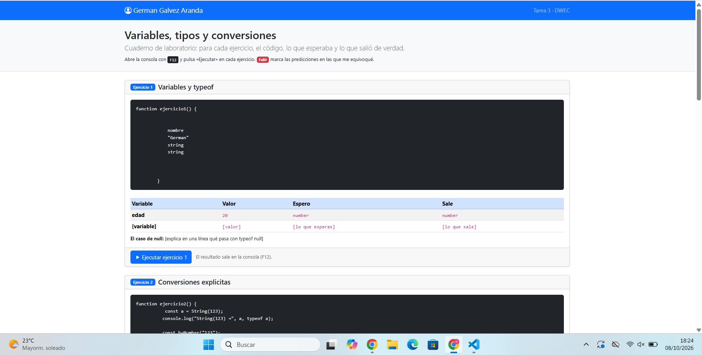
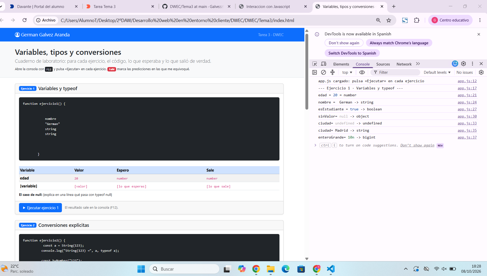
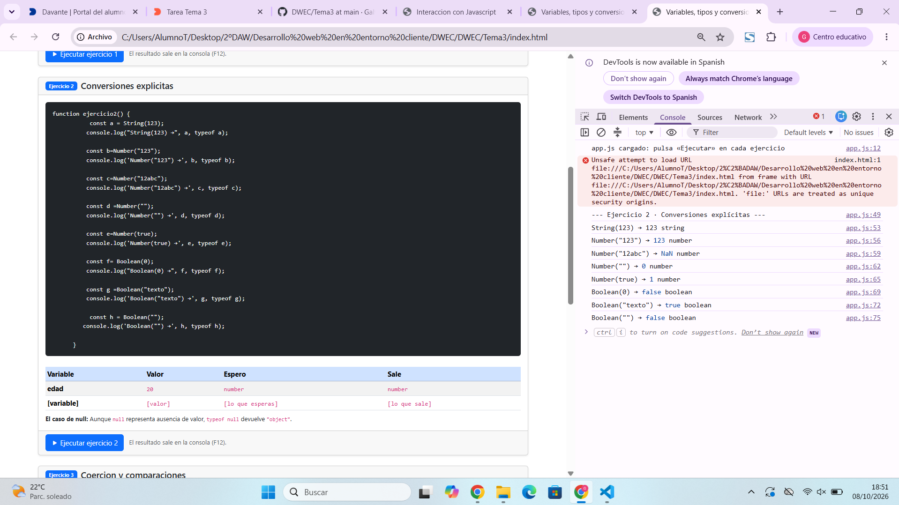

# Tarea 3 · Variables, tipos y conversiones

**Autor:** German Galvez Aranda · Desarrollo Web en Entorno Cliente (DWEC) · 2.º DAW · Curso 2026-27

## Capturas

### a) La página entera

[Qué se ve: tu nombre en la navbar, las cuatro cards y los fallos de predicción marcados.]

### b) Consola del ejercicio 1

[Qué se ve, en una o dos líneas.]

### c) Consola del ejercicio 2

[Qué se ve, en una o dos líneas.]

### d) Consola del ejercicio 3

[Qué se ve, en una o dos líneas.]

### e) Consola del ejercicio 4, con el error de la const

[Qué se ve, en una o dos líneas.]

## Reflexión

[De 5 a 8 líneas: ¿qué conversiones te resultaron más intuitivas y cuáles te sorprendieron? Pon ejemplos concretos de tus tablas.]

## Fuentes

https://developer.mozilla.org/en-US/docs/Web/JavaScript/Reference/Statements

https://developer.mozilla.org/en-US/docs/Web/JavaScript/Reference/Operators/typeof

https://developer.mozilla.org/en-US/docs/Web/JavaScript/Reference/Operators/typeofs

https://developer.mozilla.org/en-US/docs/Web/JavaScript/Reference/Template_literals

https://developer.mozilla.org/en-US/docs/Glossary/Type_coercion

## Uso de IA

[Si has usado IA: qué herramienta, para qué y qué hiciste después con su respuesta. Si no la has usado, borra este apartado.]
