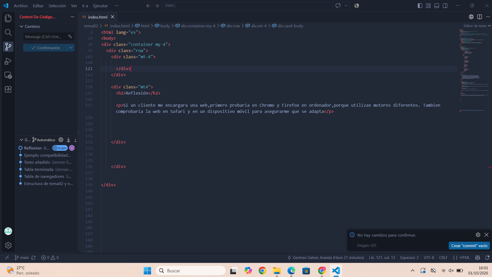
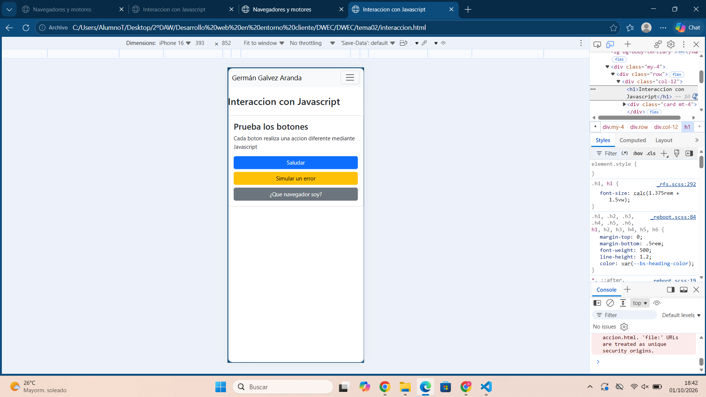
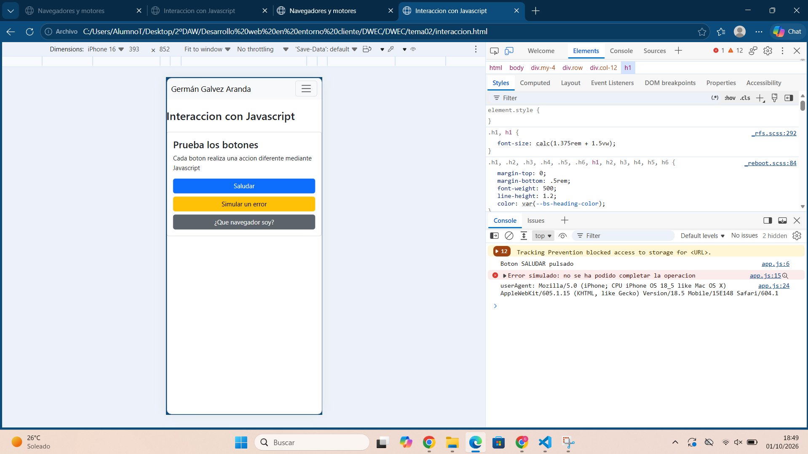

# TEMA 2 

**Germán Galvez Aranda**

En esta tarea he creado una pagina web utilizando HTML,Boostrap y Javascript. El proyecto esta formado por dos paginas:index.html donde muestro informacion sobre diferentes navegadores y interaccion.html: donde he añadido botones que hacen acciones mediante JavascriptT

# PAGINA PRINCIPAL

**En esta captura se muestra la pagina principal con la tabla de navegadores y sus motores,junto con mi nombre en el nav**

# INTERACCIÓN EN MOVIL

**En esta captura se ve la pagina adpatada a un dispositivo móvil. He utilizado las herramientras del desarrollador del navegador para ver como se muestra**

# CONSOLA

**En esta captura muestro los mensajes generados al pulsar los botones**

# PROYECTO EN VISUAL

