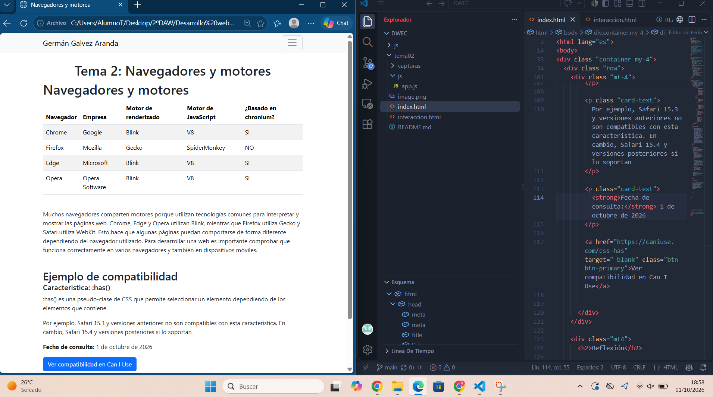

# TEMA 2 

**Germán Galvez Aranda**

En esta tarea he creado una pagina web utilizando HTML,Boostrap y Javascript. El proyecto esta formado por dos paginas:index.html donde muestro informacion sobre diferentes navegadores y interaccion.html: donde he añadido botones que hacen acciones mediante JavascriptT

# PAGINA PRINCIPAL

**En esta captura se muestra la pagina principal con la tabla de navegadores y sus motores,junto con mi nombre en el nav**

# INTERACCIÓN EN MOVIL

**En esta captura se ve la pagina adpatada a un dispositivo móvil. He utilizado las herramientras del desarrollador del navegador para ver como se muestra**

# CONSOLA

**En esta captura muestro los mensajes generados al pulsar los botones**

# PROYECTO EN VISUAL

**En esta captura se ve la captura del proyecto ev visual studio pa visualizar la pagina**

# ¿QUIÉN HACE QUÉ?

**HTML es la que organiza el contenido en la pagina. En el proyecto lo utilizo para el NAV,titulos,tablas de navegadores,textos y botones**

# BOOTSTRAP

** Bootstrap lo utilizo para dar estilo a la pagina sin tener que usar CSS. Lo utilizo para diseñar la barra de navegacion,tabla y botones**

# JAVASCRIPT

**Javascript nos permite que los botones hagan acciones/iteraciones (saludar,simular error,abir una ventana emergente,oculta menús)**

# FUENTES

**Bootstrap 5.3**
**https://developer.mozilla.org/es/docs/Web/JavaScript/Guide**
**https://es.javascript.info/**